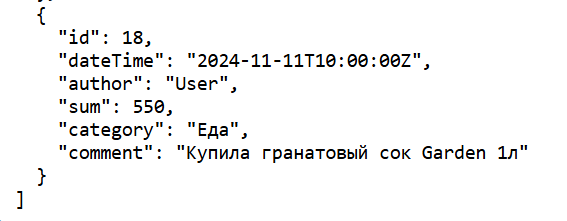

# Expense Tracker - Трекер расходов 

Простое приложение для отслеживания расходов, созданное с использованием React для фронтенда и Express с SQLite для бэкенда.

## Функциональность

- Позволяет пользователю добавлять транзакции с указанием даты, суммы, категории и комментария.
- Сохраняет транзакции в базе данных SQLite.
- Отображает список всех транзакций (доступно через API).

## Стек технологий

- **Frontend**: React, CSS для стилей, react-datepicker для выбора даты.
- **Backend**: Express, SQLite для базы данных.
- **Прочее**: Node.js, npm.

## Установка и запуск

### 1. Клонирование репозитория

Склонируйте репозиторий к себе на компьютер:

```bash
git clone https://github.com/aqqala/expense-tracker.git
cd expense-tracker
```

### 2. Установка и запуск бэкенда
 2.1. Перейдите в папку бэкенда: 
    cd backend 

 2.2. Установите зависимости: 
    npm install

 2.3. Запустите сервер: 
    node index.js 
 
 Сервер запустится на http://localhost:5000 

 
### 3. Установка и запуск фронтенда 
 3.1. Перейдите в папку фронтенда: 
    cd frontend
 
 3.2. Установите зависимости: 
    npm install

 3.3. Запустите приложение React: 
    npm start

 Приложение откроется в браузере по адресу http://localhost:3000 

## Просмотр данных
Чтобы увидеть все добавленные транзакции, откройте в браузере: 
http://localhost:5000/api/transactions


## API Endpoints
- GET /api/transactions: Получение всех транзакций.
- POST /api/transactions: Добавление новой транзакции. Пример тела запроса:
 ```bash
 {
  "dateTime": "2024-11-10T10:00:00Z",
  "author": "User",
  "sum": 100,
  "category": "Еда",
  "comment": "Обед"
} 
``` 


## Скриншоты 
 
 
 
 
  




